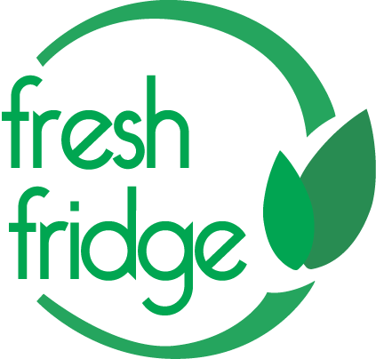

###iOS Version of Fresh Fridge (Based on [Original Android Version](https://github.com/coron108/Fresh-Fridge))

Have you ever forgotten about food in your fridge, and it was just left there to rot? With Fresh Fridge, you won't have to remember the expiration dates to all of your foods! iOS Version
#What is Fresh Fridge?
Fresh Fridge is an open source project that strives to create a mobile app that will provide an easier and more efficient way to keep track of groceries and their expiration dates. 

#Mission Statement
To create, as a community, a mobile application that will provide an easier and more efficient way to keep track of groceries and their expiration dates. 

#Goals
- Create a list of items in your refrigerator with their respective expiration dates
- Receive push notifications about when certain foods are about to expire 
- Ability to create grocery lists from within the application 

#Stretch Goals
- Availability on multiple platforms (Will only be available for Android at first)
- Recipe database that shows what food can be made with the items that you have
- Ability to scan barcodes for expiration date and food information 
- "Tips" page that gives the user suggestions on how to make food last longer and seasonal  
foods 
- Synchronization of list between multiple phones within a household 

##iOS Requirements
- Xcode 6 or above
- Develop for iOS 8 (thinking about iOS 7 compatability)
- CocoaPods

#Development Status
- Version 0.1 (beta) 
- Follow us for updates
  - Website: http://freshfridgeoss.wix.com/fresh-fridge
  - Facebook: https://www.facebook.com/freshfridgeOSS
  - Twitter: https://twitter.com/FreshFridgeOSS
- [Wireframe](./images/iOSWireFrame.png)
  
#Ways You Can Contribute (iOS)
We would love any help you can give us on the application. There are always ways you can contribute!

- Front-end Developers:
  - Either using Sketch or similar design tool, design the look and layout of the app, including the app icon. Please strictly follow [Apple's Design Guidelines](https://developer.apple.com/library/ios/documentation/userexperience/conceptual/mobilehig/).
  - Using Xcode's storyboard or nib, implement a custom design or custom control. Even programmatically generated views will be accepted if they work nicely with everything else. Swift or Objective-C is welcome.
- Back-end Developers:
  - Using Core Data, help with local storage of everything in order to keep track of lists, dates, favorites, etc.
  - Also start thinking of a back end service to use to gather data for our own analytics. Ex: [Parse](https://parse.com/)
- Food Researchers:
 - Research is a large part of our app. We need help with fact checking such as typical food expiration, seasonal foods, and recipes.
- Bug Checkers:
  - Test out the app or take a look at ways the code can be improved. Then, report  suggestions or bugs on the issue page.
- Feature Ideas:
  - Let us know what we can do to improve are application, or if you have an idea you  would like to improve upon, then fork our repository, create a branch, and create a pull  request  with your changes
- Android Developer?
  - Please considering contributing to the [Android version](https://github.com/coron108/Fresh-Fridge)!

#Step-by-Step Setup
1. Fork the Fresh Fridge repo
2. Clone the Fresh Fridge repo to your remote repository
3. If a Podfile is included, run `pod install`
4. Create a branch with your changes
5. Make a pull request with changes

